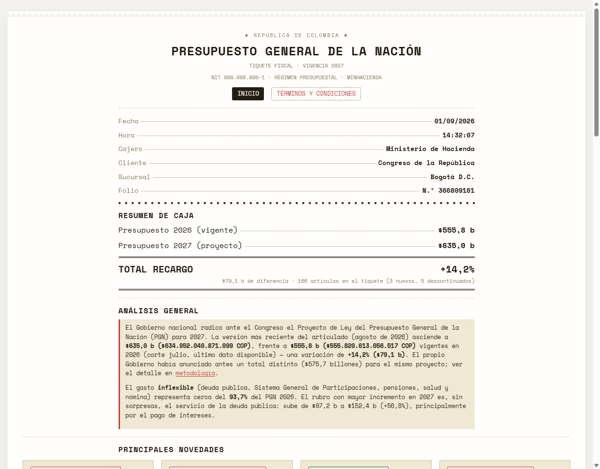
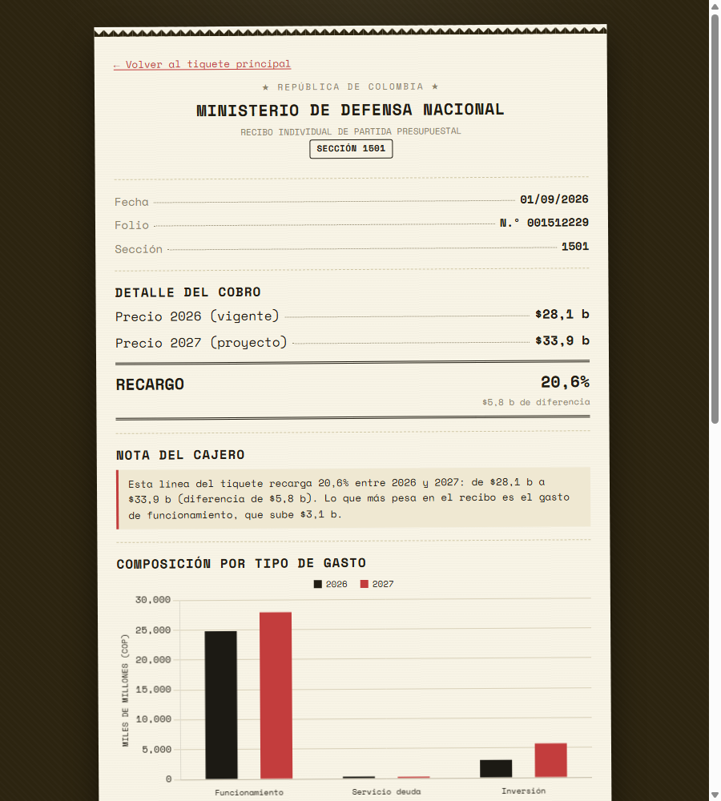

# Presupuesto General de la Nación 2027 — Colombia

Análisis independiente y visualización del Proyecto de Ley del Presupuesto General de la Nación (PGN) 2027 de Colombia, comparado sección por sección (ministerio / dependencia) contra el presupuesto vigente de 2026.

**Demo en vivo:** _(agregar el enlace de Vercel/dominio propio aquí una vez desplegado)_



## Qué muestra

- **Comparación 2026 → 2027** por cada una de las ~166 secciones presupuestales (ministerios, departamentos administrativos, superintendencias, entes autónomos, etc.), con variación absoluta y porcentual.
- **Análisis general** con el contexto macrofiscal del Mensaje Presidencial (crecimiento, déficit, inflexibilidad del gasto).
- **Principales novedades**: mayores aumentos y caídas, y reorganizaciones institucionales relevantes (p. ej. la liquidación del Ministerio de Igualdad y Equidad).
- **Gráfico interactivo** de comparación por dependencia, con tres criterios de orden (mayor presupuesto, mayor aumento %, mayor caída %).
- **Ficha individual por dependencia** (`/detalle.html?codigo=NNNN`) con el desglose por tipo de gasto (funcionamiento, servicio de la deuda, inversión) y por programa presupuestal.
- **Metodología** completa y transparente, incluyendo una advertencia importante: el Gobierno citó más de una cifra total distinta para el PGN 2027 durante el trámite del proyecto — ver [`metodologia.html`](metodologia.html).



## Fuentes de datos

| Año | Fuente | Detalle |
|---|---|---|
| 2027 | Proyecto de Ley del PGN 2027, articulado radicado ante el Congreso (agosto de 2026) | $634,95 billones — desagregado por sección, tipo de gasto y programa |
| 2026 | [Datos Abiertos Colombia](https://www.datos.gov.co/Hacienda-y-Cr-dito-P-blico/Informaci-n-de-Gastos-del-Presupuesto-General-de-l/5phs-yqfw) — Ejecución Presupuestal del PGN, Ministerio de Hacienda | $555,82 billones — apropiación vigente, corte julio de 2026 |

Detalle completo de metodología, supuestos y limitaciones conocidas en [`metodologia.html`](metodologia.html).

## Stack técnico

Sitio 100% estático — sin build, sin framework, sin dependencias de servidor:

- HTML/CSS/JS puro (`index.html`, `detalle.html`, `metodologia.html`, `assets/`)
- [Chart.js](https://www.chartjs.org/) (vía CDN) para las gráficas
- Datos pre-procesados en `data/presupuesto.json`, generados a partir del Excel oficial y del dataset de Datos Abiertos con los scripts en `scripts/` (Python)

## Correr localmente

No requiere instalar dependencias de JavaScript. Solo necesitas Python (o cualquier servidor estático):

```bash
python -m http.server 8000
```

Y abre `http://localhost:8000/index.html`. (Abrir el `index.html` con doble clic no funciona: el navegador bloquea la carga de `data/presupuesto.json` sin un servidor de por medio).

## Regenerar los datos

Si aparece una versión más reciente del proyecto de ley o un corte más actualizado del presupuesto 2026, los datos se pueden regenerar con:

```bash
pip install openpyxl
python scripts/1_extract_2027_xlsx.py    # Excel oficial -> data/raw/pgn2027_raw.json
bash scripts/2_fetch_2026.sh Julio       # Datos Abiertos -> data/raw/pgn2026_by_entidad_tipo.json
python scripts/3_build_dataset.py        # combina ambos -> data/presupuesto.json
```

## Desplegar

Al ser un sitio estático, se despliega en [Vercel](https://vercel.com) sin configuración: conecta este repositorio y listo. Ver `DEPLOY.md` para la guía paso a paso, incluyendo cómo apuntar un dominio/subdominio propio.

## Aviso

Este es un ejercicio independiente de visualización de datos públicos. No tiene relación con el Congreso de la República ni con el Gobierno nacional de Colombia.
